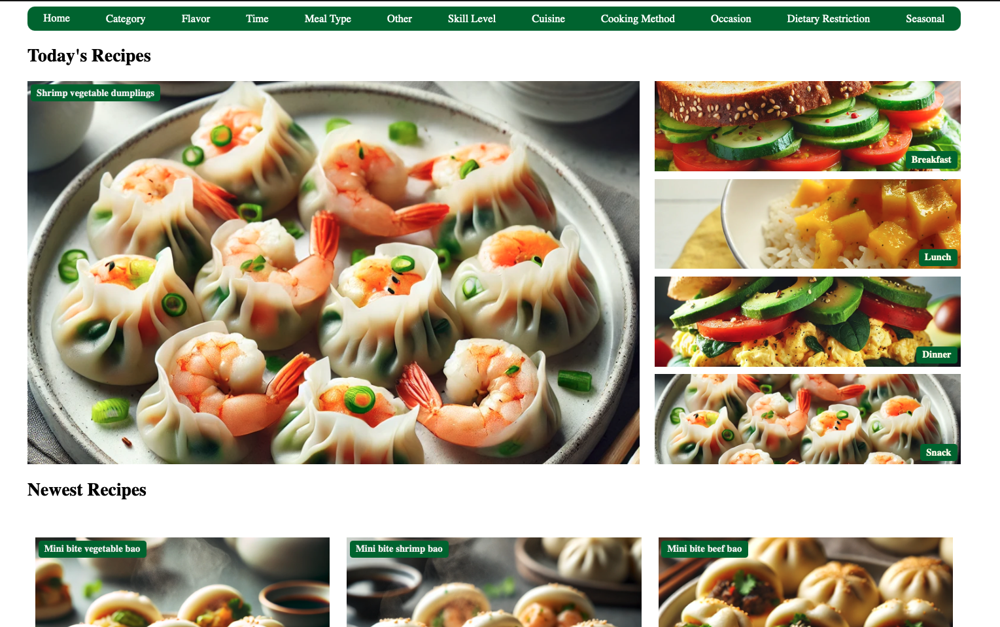
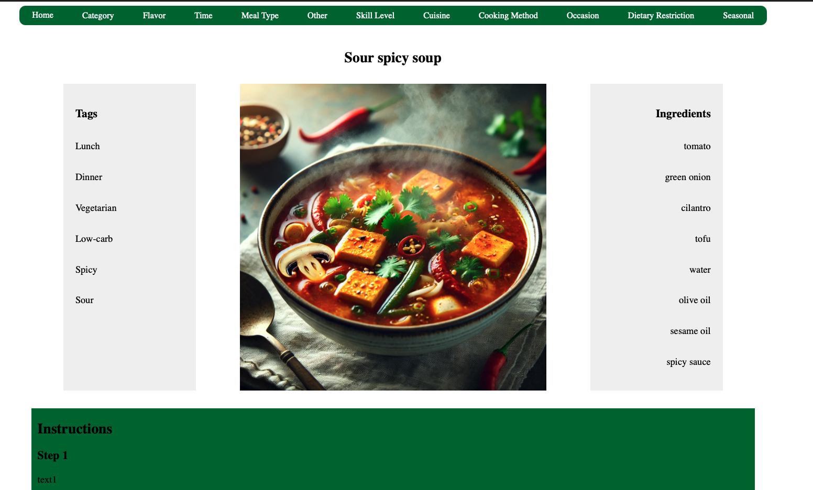
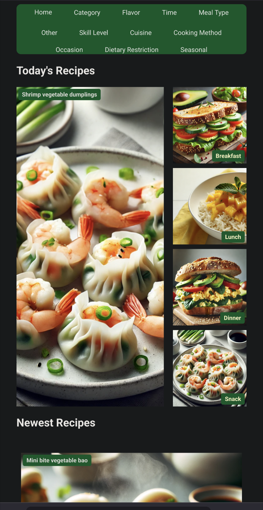
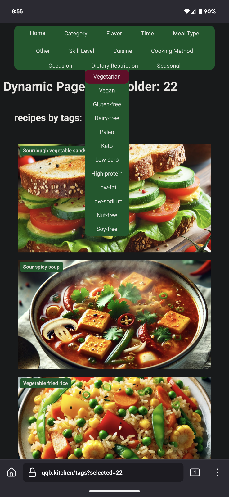
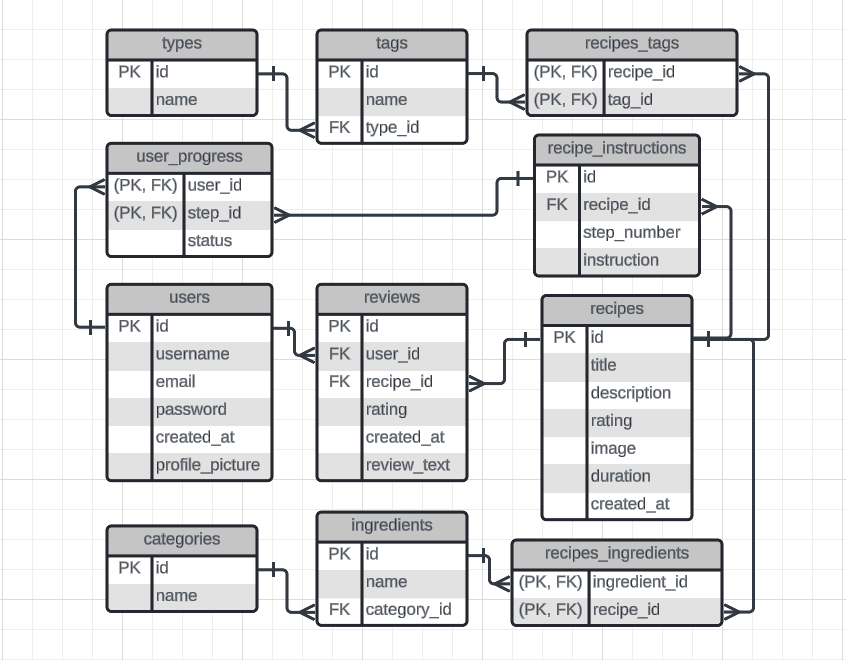

# Ning's Kitchen
Discover and explore personalized recipes tailored to your taste!

## Table of Contents

- [Project Overview](#project-overview)
- [User Interface](#user-interface)
- [Disclaimer](#disclaimer)
- [Features](#features)
- [Database Schema](#database-schema)
- [Installation](#installation)
- [Key Dependencies](#key-dependencies)
- [Usage](#usage)

## Project Overview

**Ning's Kitchen** is a responsive recipe website designed to provide users with a seamless and engaging experience in discovering and managing recipes. The application is built with a Java Spring Boot backend and a PostgreSQL database utilizing PL/pgSQL for stored procedures and functions, ensuring robust data management. The frontend is developed using React and TypeScript, offering a modern and interactive user experience.
Further development is underway to enhance the website's functionality and user experience, with plans to introduce more features and improvements.

This application is currently hosted on Amazon Web Services (AWS), ensuring seamless accessibility through the website. Ongoing development is focused on enhancing functionality and improving the user experience.

## User Interface

### Desktop View
<br>
<br>


### Mobile View
<div>
  
  
</div>

## Disclaimer

This project is currently under active development and is part of my personal portfolio. It is intended to showcase my skills in fullstack development. Please note:
- This project is not suitable for production use due to its experimental nature and ongoing development. 
- It is intended for demonstration purposes only.
- Features are being actively added and refined.

## Features

- **Recipe Display** _(Implemented)_: Features a homepage with sections for "Today’s Recipes" and "Newest Recipes," providing users with fresh and relevant content.
- **Dynamic Navigation System** _(Implemented)_: Allows users to filter recipes using multi-select dropdown menus, with support for dietary restrictions, meal types, cuisines, and more, all managed through URL-based state management.
- **Recipe Instruction Page** _(Implemented)_: Clicking on a recipe image redirects users to a dedicated instruction page. This page displays categorized tags, a detailed ingredient list, and step-by-step preparation instructions, offering users a comprehensive cooking guide.
- **Upcoming Feature** _(Ongoing)_: Placeholder

## Database Schema
The following diagram illustrates the structure of my database:




## Installation

Follow these steps to set up the project locally on your machine.

### Prerequisites

Ensure you have the following software installed on your system:

- **Node.js**: [Download and install Node.js](https://nodejs.org/).
- **npm**: Comes with Node.js, but ensure it's up to date by running `npm install -g npm`.
- **Java Development Kit (JDK)**: [Download and install JDK](https://www.oracle.com/java/technologies/javase-jdk11-downloads.html) (version 21).
- **Maven**: [Download and install Maven](https://maven.apache.org/install.html).
- **PostgreSQL**: [Download and install PostgreSQL](https://www.postgresql.org/download/) and ensure the server is running.

### Clone the Repository

Clone the project repository from GitHub:

```bash
git clone https://github.com/ning-2021/Ning-s-Kitchen.git
cd Ning-s-Kitchen
```
## Key Dependencies

This project uses several important libraries and tools to deliver its functionality across both the backend and frontend components.

### Backend

- **Spring Boot**: Provides the backend framework for building and running the server-side application.
- **PostgreSQL**: Serves as the primary database for storing and managing application data.

### Frontend

- **React**: A JavaScript library for building user interfaces, used for the frontend of the application.
- **React Router**: Manages navigation and routing in the React application.
- **Axios**: Handles HTTP requests to the backend API.

### Development Tools

- **TypeScript**: Adds static typing to JavaScript, improving code quality and developer experience.
- **Webpack**: Bundles JavaScript files for usage in a browser, along with various plugins for optimization.
- **Babel**: Transpiles modern JavaScript and TypeScript into versions compatible with older browsers.

These dependencies are managed through `package.json` for the frontend and `pom.xml` for the backend, ensuring a consistent and reproducible development environment.

## Usage

This project includes several npm scripts to help with development, building, and maintenance tasks. Below is a description of each script and how to use them.

### Scripts

- **Frontend Development**:
    - **Command**: `npm run frontend`
    - **Description**: Starts the webpack development server using the configuration specified in `webpack.config.ts` with development mode enabled. This is useful for working on the frontend part of the application, allowing you to see changes in real-time as you develop.

- **Backend Development**:
    - **Command**: `npm run backend`
    - **Description**: Runs the Spring Boot application using Maven. This script is used for developing and testing the backend services of the application.

- **Concurrent Development**:
    - **Command**: `npm run dev`
    - **Description**: Utilizes the `concurrently` package to run both the frontend and backend development servers simultaneously. This setup is ideal for full-stack development, enabling you to work on both the frontend and backend at the same time.

- **Build**:
    - **Command**: `npm run build`
    - **Description**: Compiles the project using webpack. This script is typically used to prepare the application for production deployment by bundling and optimizing the frontend assets.

- **Clean Install**:
    - **Command**: `npm run clean-install`
    - **Description**: Removes the `node_modules` directory and `package-lock.json` file, then reinstalls all dependencies. This is useful for ensuring a clean setup, especially if you encounter issues with dependencies or need to reset your environment.

- **Clean**:
    - **Command**: `npm run clean`
    - **Description**: Runs `npm prune` to remove extraneous packages from the `node_modules` directory. This helps keep your project tidy by ensuring only the necessary packages are installed.
